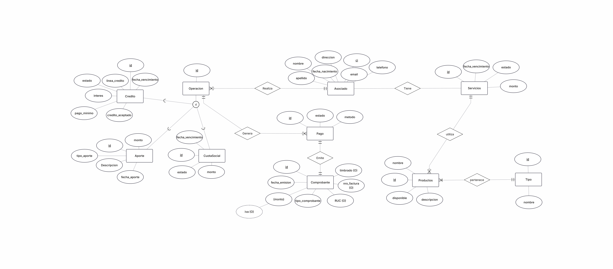

# Diseño de Base de Datos: Sistema de Gestión Financiera

## Contexto del Negocio (Business Case)
Una institución financiera requiere modernizar su sistema informático central para optimizar la gestión de sus asociados y los productos financieros ofrecidos. El objetivo de esta actualización es mejorar la integridad de la información y preparar la arquitectura de datos para futuras integraciones con APIs y servicios de terceros (pasarelas de pago, facturación electrónica y emisión de recibos).

## Alcance y Reglas de Negocio
El diseño de la base de datos debe soportar las siguientes operaciones core:
* **Gestión de Asociados:** Registro y administración del padrón de miembros.
* **Productos Financieros:** Seguimiento y control de cuotas sociales, aportes, y el otorgamiento y estado de créditos.
* **Facturación e Integraciones:** Estructura preparada para emitir comprobantes legales y conectarse con entes externos.

---

## Modelo Entidad-Relación (E-R)
Aquí se presenta el diseño visual de la base de datos, aplicando normalización y asegurando la integridad referencial.

 
*(Nota: Si no puede visualizar los detalles, haga clic en la imagen para ampliarla).*

---

## Entregables Técnicos y Código Fuente
Este repositorio contiene la arquitectura inicial del proyecto (Diseño Conceptual y Lógico). 

**Instrucciones de revisión técnica:**
Los archivos fuente originales se encuentran en este repositorio para su visualización o modificación:
* **Modelo Conceptual (ERDPlus):** Descargue el archivo `TPBDparcial.erdplus` e impórtelo en [ERDPlus.com](https://erdplus.com/).
* **Modelo Relacional (Power Architect):** Descargue el archivo `TPBD.architect` y ábralo utilizando el software SQL Power Architect.
